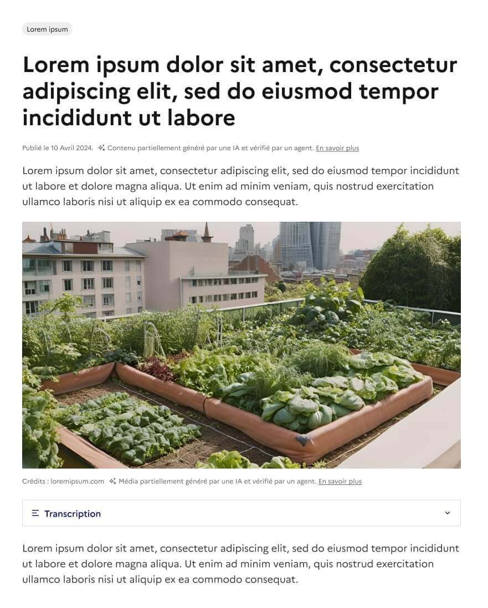
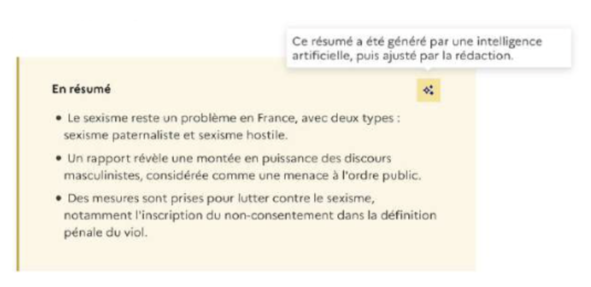

# IA - Charte d'utilisation responsable

L'utilisation de l'IA générative (Claude, Mistral, ChatGPT …) dans les Ministère de la Transition Écologique est autorisée et encouragée pour gagner en efficacité.&#x20;

Les agents de l’état on la responsabilité d’informer les usagers de la provenance du contenu. Cette transparence assure une relation de confiance entre les usagers et nos services et assoit la fiabilité du contenu proposé.

Tout contenu généré partiellement ou totalement par une IA doit être signalé à l’usager. Une mention standardisée doit ainsi apparaître sur les sites et applications du Ministère de la Transition Écologique : &#x20;

> Contenu/Média partiellement/intégralement généré par une IA et vérifié par un agent.&#x20;

**Ressources :**&#x20;

* [La note du SIG de juin 2024](https://kiosque.communication.gouv.fr/documentations/information-et-transparence-sur-lutilisation-de-service-dia-generative)
* [Charte d'usage de l'IA de la communication de l'État](https://kiosque.communication.gouv.fr/documentations/charte-dusage-de-lia-de-la-communication-de-letat)
* [La page dédiée sur le site du DSFR](https://www.systeme-de-design.gouv.fr/version-courante/fr/a-propos/articles-et-actualites/presence-de-l-ia-dans-les-contenus)

***

#### Quand afficher une mention IA ?

**1. Aide personnelle, pas besoin de mention**

Quand l’IA est un outil d'assistance. C'est vous qui finalisez, vérifiez et publiez le contenu. Les usagers voient votre travail achevé, il n'y a pas besoin de mention.

*Exemple : vous utilisez l'IA pour corriger un brouillon, vous aider à rédiger, traduire, ou résumer du contenu.*

**2. Publication de contenu généré par IA, la mention est obligatoire.**

Quand le contenu a été généré ou amélioré par l'IA, vous afficher l'information à l'usager.

*Exemples : une image générée par l'IA est mise en ligne, un article a été écrit en partie par l'IA, une vidéo est générée par l'IA.*

**Comment afficher la mention ?**

* Faire figurer une mention spécifique en préambule d’un texte lorsque celui-ci a été rédigé en partie ou complètement à l’aide d’un outil d’IA générative ;
* Faire figurer une mention spécifique sous une image ou sous une vidéo, lorsque celle-ci a été produite en partie ou complètement à l’aide d’un outil d’IA générative ;
* Ces mentions doivent être précédées de [l'icône prévue à cet effet](https://www.systeme-de-design.gouv.fr/version-courante/fr/a-propos/articles-et-actualites/presence-de-l-ia-dans-les-contenus#l-icone) ✨ ;
* Renvoyer vers une page d’information type mentions légales explicitant quels outils ont été utilisés, dans quelle mesure ils ont été utilisés et pour quelle raison.

#### Exemples&#x20;

<figure><figcaption>
Indication que le contenu a été partiellement généré par une IA et vérifié par un agent.
</figcaption></figure>

<figure><figcaption>
Indication que le contenu a été généré par IA et ajusté par la rédaction
</figcaption></figure>

!!! note

    #### **En tant qu'agent de la fonction publique, comment utiliser l'IA dans mon quotidien ?**

    *Rappel des bonnes pratiques issues de la charte Charte d'usage de l'IA de la communication de l'État*

    1. Proscrire des prompts toute donnée sensible :

    * Données personnelles (noms, emails, adresses, numéros de Sécurité sociale)
    * Secrets de défense ou informations confidentielles
    * Contenus préparatoires non publics
    * Identifiants, mots de passe, tokens API

    2. Toujours vérifier et citer les sources :

    * Demander des sources et des citations
    * Vérifier manuellement chaque source (URL, date, auteur)
    * Vérifier que le contenu généré correspond à la réalité factuelle

    3. Garder le contrôle humain&#x20;

    * Relire et valider chaque contenu avant publication
    * Ne pas automatiser les actions dangereuses (envoi d'email, modification d'accès)
    * Prendre la décision finale vous-même, jamais déléguer au système
    * Limiter les droits d'accès (l'IA n'a besoin que de ce qui est nécessaire)

    4. Respecter les droits d'auteur

    * Vérifier que le contenu généré ne reproduit pas un contenu protégé
    * Consulter les conditions d'utilisation de l'outil IA
    * Transformer / reformuler plutôt que de reprendre du contenu existant

    **Souveraineté numérique : privilégier l’Europe**

    Dans un souci de sécurité et d'indépendance technologique, préférez les outils français ou européens quand leurs performances sont équivalentes.

    * Mistral (France)
    * GenIAl (administration française)
    * Assistant IA déployé au sein des ministères
    * Claude (Anthropic, conforme RGPD)

---
