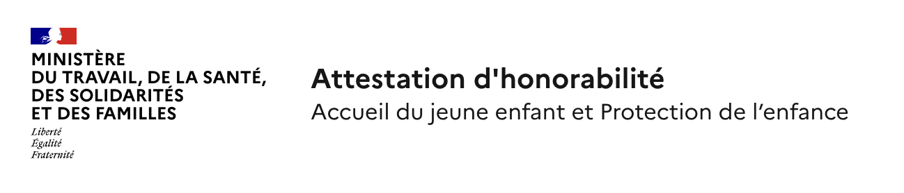
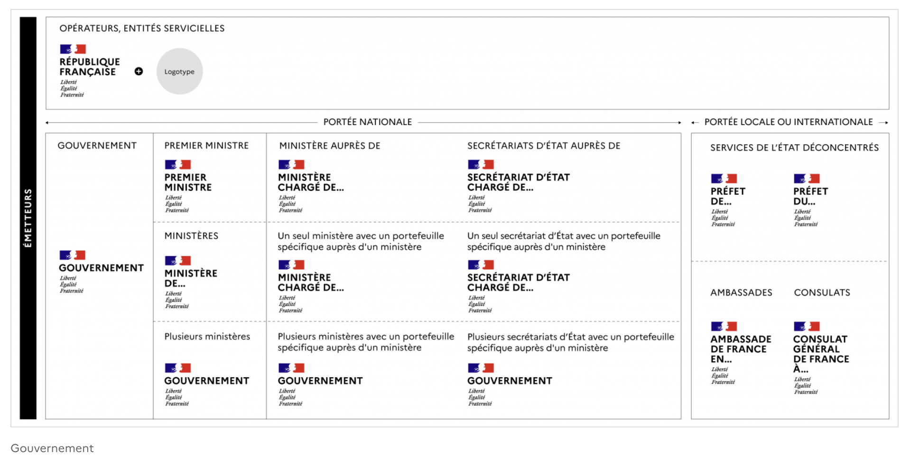
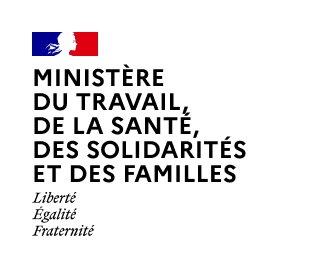
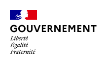
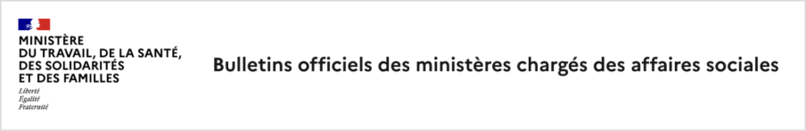
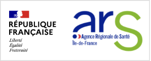
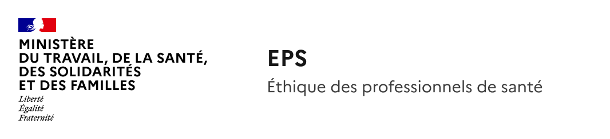
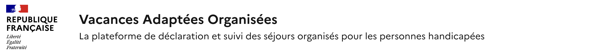

# En-têtes des sites

Tout site porté par l’Etat et ses opérateurs doit respecter les règles d’usage de la marque Etat. Dans le cas des sites soumis à agrément du SIG, le non-respect des règles d’usage entrainera le refus de l’agrément.

Ces règles permettent de garantir une meilleure lisibilité pour les usagers et de renforcer la confiance dans nos services en ligne.

!!! danger

    Les bloc-marques évoluant au rythme des changements ministériels, ceux présentés sur cette page le sont à titre d'exemple. Se reporter aux modèles mis à jour dans le fichier Figma présent dans les ressources utiles.

<figure><figcaption></figcaption></figure>

Exemple d'un bloc-marque ministériel avec le nom du produit en titre et sa baseline

Ressources utiles :

* [L'architecture de marque de l’État](https://www.info.gouv.fr/marque-de-letat/l-architecture-de-marque-de-l-etat)
* [Circulaire 6411-SG du 7 juillet 2023](https://www.systeme-de-design.gouv.fr/version-courante/fr/premiers-pas/perimetre-d-application)
* [Jaune budgétaire 2025 (section "accès rapide" en bas de page)](https://www.budget.gouv.fr/documentation/documents-budgetaires/exercice-2025/projet-loi-finances-les/jaunes-budgetaires-2025-plf-2025)
* [Modèles d'en-têtes à utiliser (maquettes Figma)](https://www.figma.com/design/1F77YLcBVbNw4CCEUr9PSQ/Mod%C3%A8les-de-pages-et-standards-d-espacements?node-id=4355-3259\&p=f\&t=6AiqhwsDt4COtXlj-11)

***

Il faut distinguer 3 types de site :

* **Sites des Ministères, secrétariats d’État, services déconcentrés ou à l’étranger :** sites vitrines, sites web externes ou internes associés à ces entités. Exemples : sante.gouv.fr, travail-emploi.gouv.fr, [www.egalite-femmes-hommes.gouv.fr](https://www.egalite-femmes-hommes.gouv.fr/).
* **Sites d’opérateurs :** sites d’établissements publics inscrits au jaune budgétaire de l’année en cours. Exemple d’opérateurs : ARS, INSERM, France Travail.
* **Sites serviciels :** sites d’entités ayant un point de contact physique avec le public, et/ou une expérience servicielle individuelle en ligne nécessitant par exemple un système de login/mot de passe. Ces sites doivent rendre un service direct à l’usager, proposer un accueil du public ou bénéficier d’une très forte notoriété. Exemples : egapro.travail.gouv.fr, sante.fr.
  * Sont exclus :
    * les sites purement informatifs,
    * les entités ne disposant pas de service direct à l’usager.

!!! note

    Si la catégorie d'un site n'est pas évidente, contacter la DICOM et le responsable design avant toute décision.

***

### Comment représenter mon produit dans l'en-tête de mon site ?

<table data-header-hidden><thead><tr><th width="141.859375">Type de site</th><th>Bloc-marque</th><th>Logo possible ?</th><th>Exemple</th></tr></thead><tbody><tr><td>Type de site</td><td>Bloc-marque</td><td>Logo possible ?</td><td>Exemple</td></tr><tr><td>Ministère</td><td>Ministère ou Gouvernement</td><td>❌ Non</td><td>sante.gouv.fr</td></tr><tr><td>Opérateur</td><td>RF ou Ministériel</td><td>✅ Oui</td><td>ARS IDF</td></tr><tr><td>Serviciel</td><td>RF ou Ministériel</td><td>✅ Oui (après validation DICOM/DNUM)</td><td>egapro.travail.gouv.fr</td></tr></tbody></table>

<figure><figcaption></figcaption></figure>

Représentation des droits d'utilisation des bloc-marques et logo en fonction des entités émettrices

#### Pour les sites ministériels

Le bloc-marque du ministère est obligatoire. Si plusieurs ministères portent le site/produit, utiliser le bloc-marque Gouvernement.

⚠️ L’utilisation d’un logotype et/ou du bloc-marque République Française ne sont pas autorisés. L’agrément SIG, si nécessaire, sera refusé.

Que faire si un site ministériel a déjà un logo ? En cas de refonte ou d’évolution, le logo devra être retiré lors d’une prochaine mise en production.

<figure><figcaption></figcaption></figure>

Bloc-marque Ministère de la Transition Écologique

<figure><figcaption></figcaption></figure>

Bloc-marque gouvernement

<figure><figcaption></figcaption></figure>

Exemple d'en-tête de site ministériel

#### Pour les opérateurs de l'Etat

Les opérateurs inscrits au jaune budgétaire ont la possibilité d’afficher leur logotype à côté du bloc-marque République Française. En revanche, les opérateurs qui le souhaitent peuvent afficher un attachement avec leur ministère en utilisant le bloc-marque du ministère et le nom de leur site en HTML. Cette décision doit être prise en collaboration avec la DICOM du Ministère de la Transition Écologique.

⚠️ L’utilisation d’un logotype n’est pas possible avec le bloc-marque du ministère.

 

Exemple d'en-têtes d'opérateurs, sites de l'ARS Ile de France et de France Travail

#### Pour les entités servicielles

Les entités rendant un service à l’usager peuvent afficher un logotype à côté du bloc-marque République Française, ce n’est pas une obligation. Ces entités peuvent choisir d’utiliser le bloc-marque du ministère et le nom de leur site et description du site en Html.

Pour les nouveaux logos : l’utilisation d’un logotype est soumise à approbation au cas par cas par arbitrage DICOM/DNUM-SIG afin de limiter l’inflation d’identités graphiques auxquelles sont exposés les citoyens.

!!! note

    Dans le doute, demander à la DICOM et au responsable du design avant d’engager la création d’un logo.

<figure><figcaption></figcaption></figure>

Exemple d'en-tête de site serviciel sans logo avec le bloc-marque ministériel, le nom du site et sa description

<figure><figcaption></figcaption></figure>

Exemple d'en-tête de site serviciel avec le bloc-marque République Française, le nom du site et sa description

---
