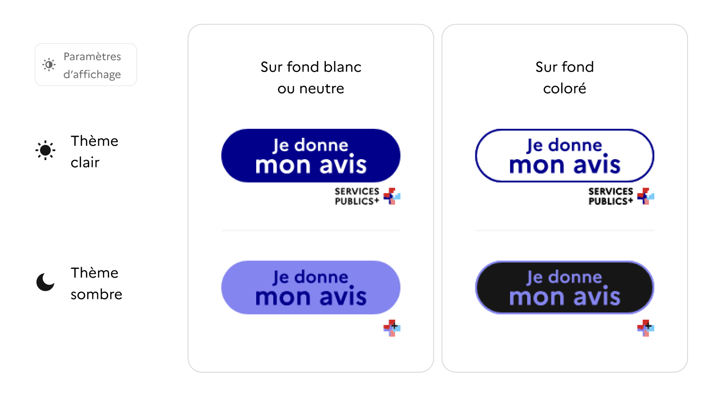
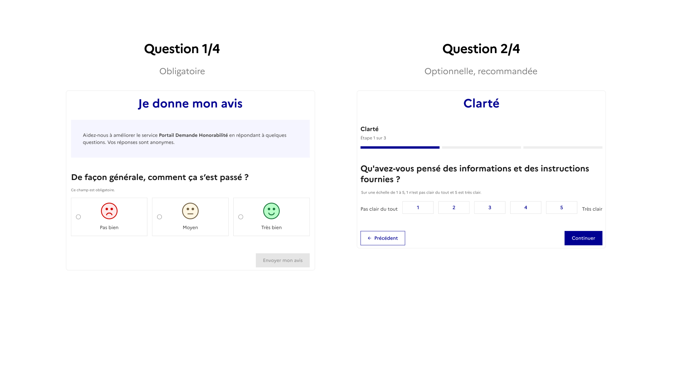
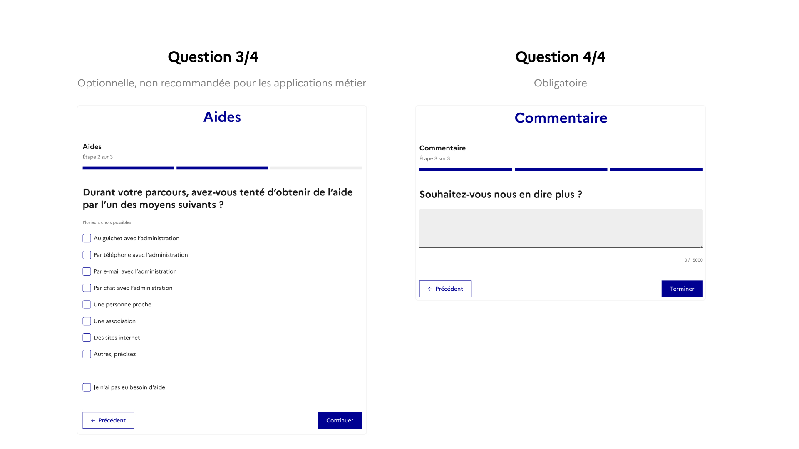
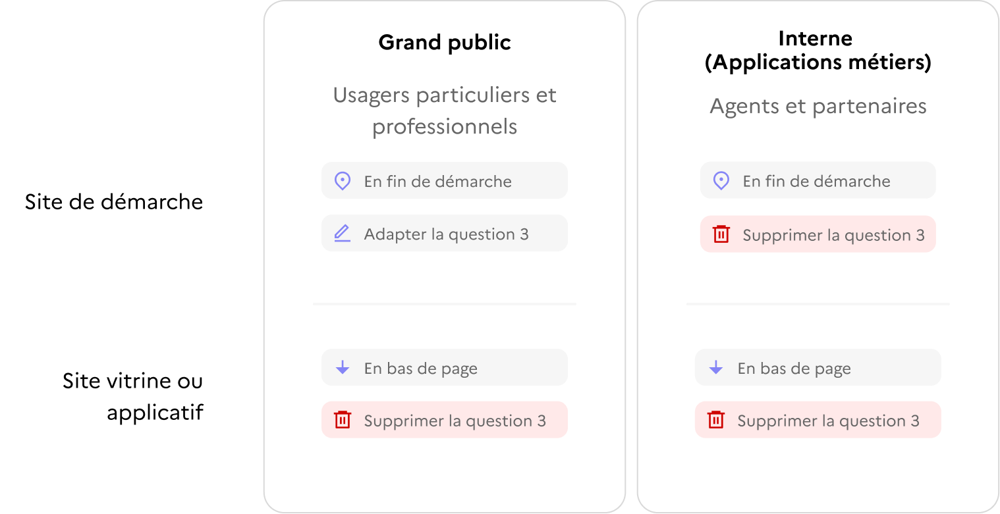
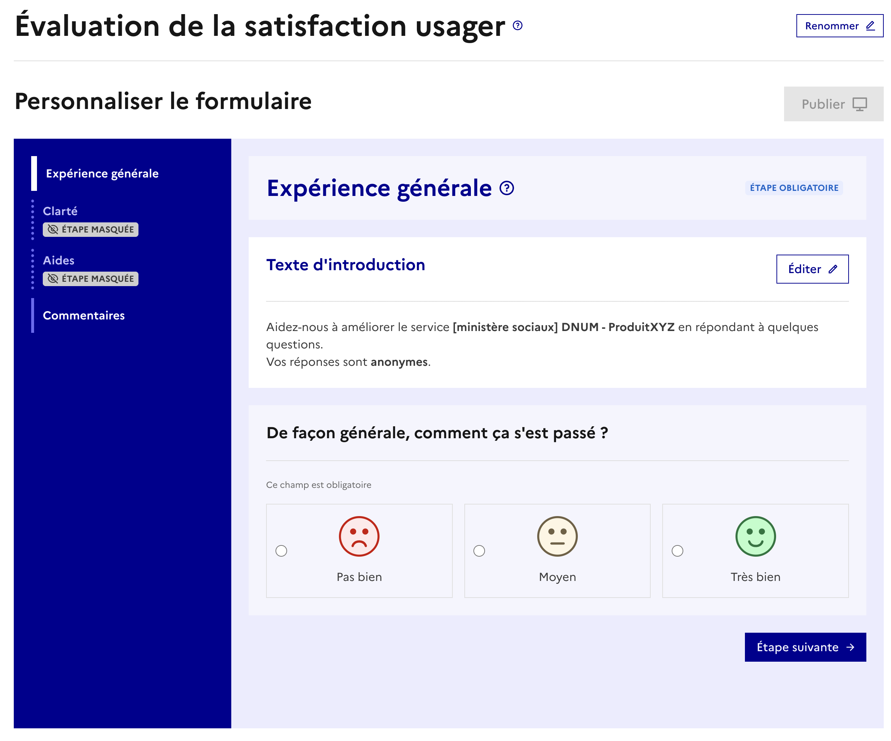
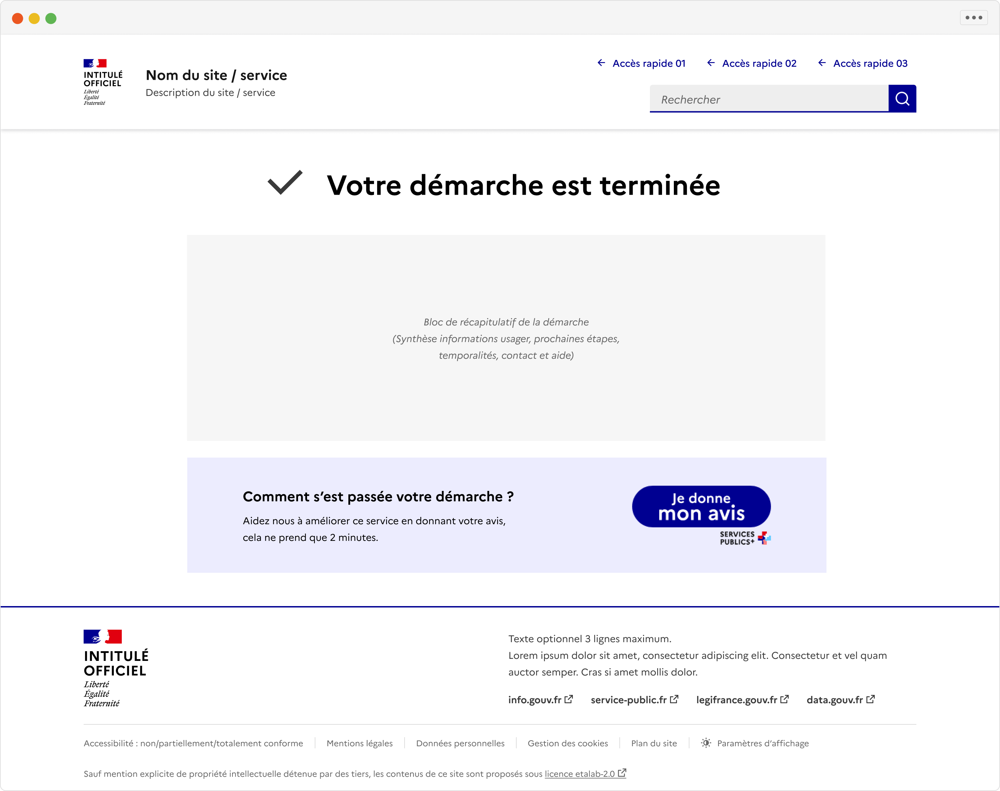
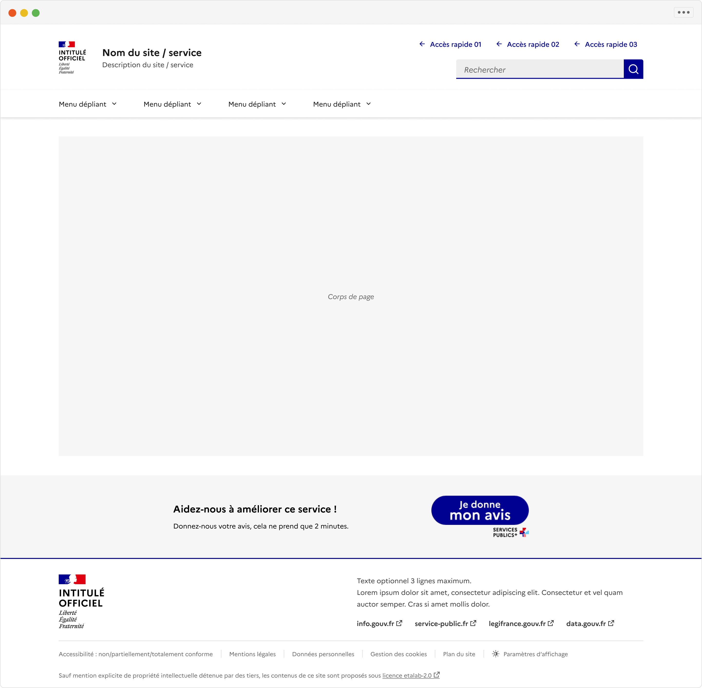
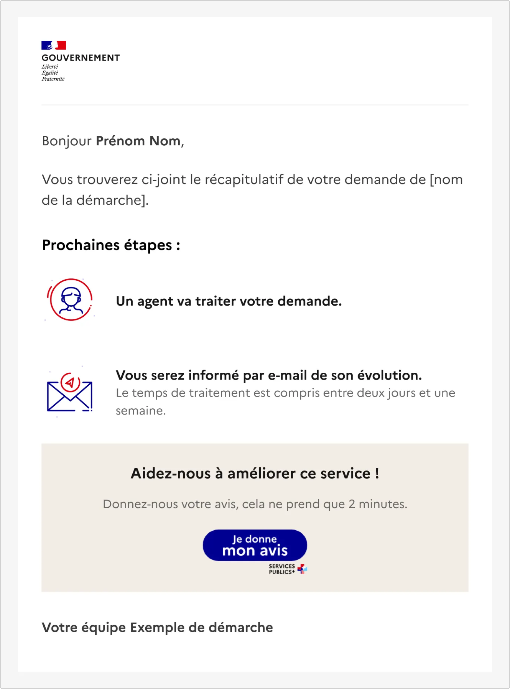
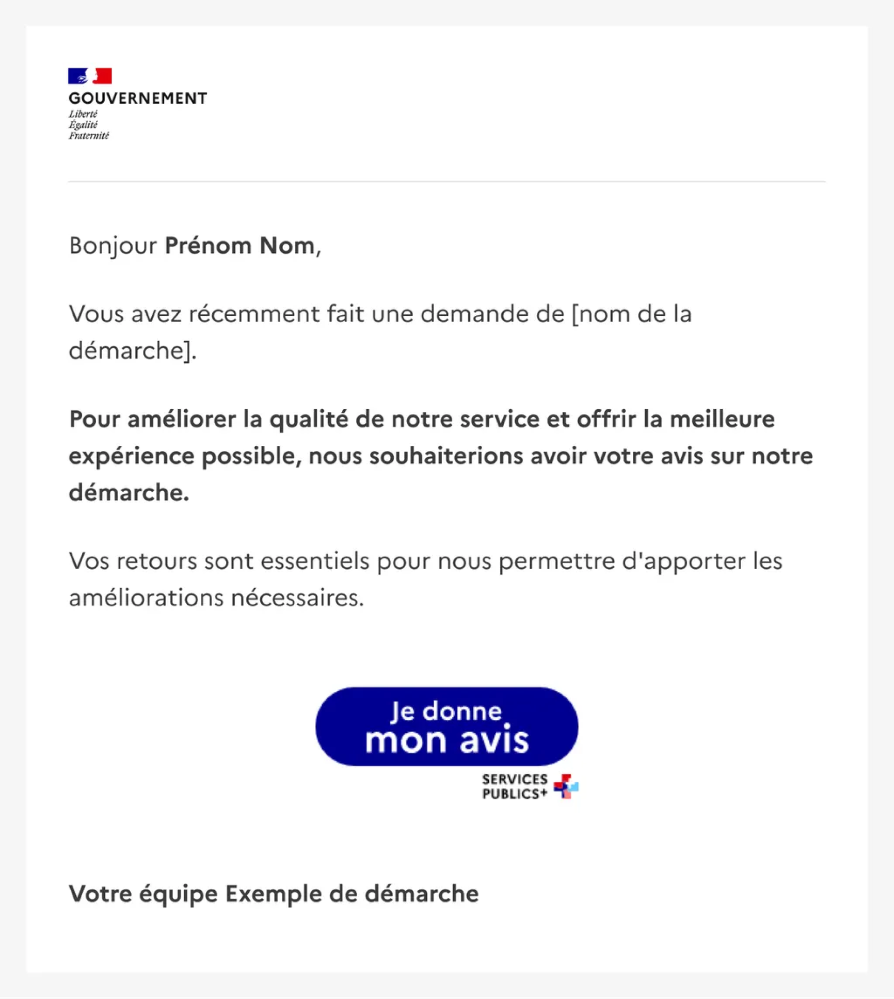

# Mesurer la satisfaction avec le bouton JDMA

Le bouton **Je donne mon avis (JDMA)** est un module standardisé permettant de recueillir, directement depuis une interface numérique de l’État, le ressenti des usagers comme des agents sur leur expérience.

Intégré à un site, une démarche en ligne ou une application métier, il offre un moyen simple et rapide de mesurer la satisfaction, de collecter des verbatim exploitables et d’identifier certains irritants du parcours réel.

Le bouton JDMA répond à plusieurs exigences de la circulaire du 7 juillet 2023 (DINUM et SIG) :

* mesurer la satisfaction au plus près de l’usage, sans interrompre le parcours.
* recueillir des verbatim exploitables pour guider les améliorations continues.
* contribuer à l’objectif interministériel : atteindre un indice de satisfaction supérieur à 8/10.
* appuyer une démarche de conception centrée utilisateur.

Afin de maximiser le nombre de retours et d’en assurer la pertinence, le bouton JDMA doit être intégré de manière :

* **contextuelle** : placé au bon endroit et au bon moment du parcours ;
* **pertinente** : associé à une demande claire, compréhensible et adaptée au public cible (usager ou agent).

> Son intégration est obligatoire pour les démarches recensées dans l’[Observatoire de la qualité des services numériques](https://observatoire.numerique.gouv.fr/), et fortement recommandée pour les autres produits et outils numériques de l’État.

!!! note

    * Le bouton s'intègre directement sur le site en une ligne de code. Ce code contient même le visuel qui s'affichera automatiquement sur le site. C'est fait en 5 minutes !
    * Le bouton n'impacte pas le score RGAA et est compatible avec le DSFR.
    * En cas de doute sur l'utilisation, l'emplacement ou la sémantique, contacter l'équipe design.

Ressources et références :

* <https://jedonnemonavis.numerique.gouv.fr/>
* [Circulaire 6411-SG du 7 juillet 2023](https://www.systeme-de-design.gouv.fr/version-courante/fr/premiers-pas/perimetre-d-application)
  * [Note d'application de la DINUM](https://www.systeme-de-design.gouv.fr/static/file/Note_DINUM_qualite_des_services_numeriques_17_07_2023.pdf)
* [Fichier Figma Design Social Gouv - les ressources visuelles](https://www.figma.com/design/1F77YLcBVbNw4CCEUr9PSQ/Mod%C3%A8les-Social-Gouv--composants--pages-?node-id=4497-58322\&t=flzakH2os0yZBXc6-11)
* Exemple avec une démarche "test"
  * [Démarche de test - Exemple de formulaire JDMA](https://jedonnemonavis.numerique.gouv.fr/Demarches/3119)
  * [Démarche de test - Exemple de statistiques disponibles](https://jedonnemonavis.numerique.gouv.fr/public/product/3119/stats)

<figure><figcaption>
Bouton JDMA, novembre 2025
</figcaption></figure>

***

### Comment ajouter le bouton ?

Le module s’intègre via un script unique, disponible sur <https://jedonnemonavis.numerique.gouv.fr/>

1. Se connecter au site JDMA via ProConnect
2. Ajouter un service puis **sélectionnez votre organisation**. Si votre organisation n'est pas présente, veuillez contacter votre responsable du design. Organisations disponibles :
   * DGCS
   * DGEFP
   * DGOS
   * DGS
   * DSS
   * DGT
   * DNUM : organisation à prioriser pour les directions du secrétariat général
3. Suivre les étapes de création du formulaire,
4. Ajouter le code fourni au site,
5. Consulter en ligne ou exporter pour analyse, les retours collectés pour chaque produit.

!!! note

    Il est possible de créer plusieurs emplacements du même formulaire et suivre le nombre de réponses en fonction des emplacements choisis.

***

### Questions du formulaire "Je donne mon avis"

Le formulaire est composé de 4 questions dont deux sont optionnelles.

<figure><figcaption></figcaption></figure>

<figure><figcaption></figcaption></figure>

1. **Question 1 :** **Expérience générale**
   1. Question posée : *De façon générale, comment ça s’est passé ?*
   2. Note de satisfaction de 1 à 3. Cette note est transformée en note sur 10 (1=0, 2=5, 3=10), la moyenne sur 10 est communiquée.
2. **Question 2 :** **Clarté (optionnelle, recommandée)**
   1. Question posée : *Qu’avez-vous pensé des informations et des instructions fournies ?*
   2. Sur une échelle de 1 à 5, 1 n'est pas clair du tout et 5 est très clair.
   3. Cette question est optionnelle mais recommandée pour tous les utilisateurs.
3. **Question 3 :** **Aide (optionnelle, non recommandée pour les applications métier)**
   1. Questions posées :
      1. *Durant votre parcours, avez-vous tenté d’obtenir de l’aide par l’un des moyens suivants ? (plusieurs choix possibles)*
      2. *Quand vous avez cherché de l’aide, avez-vous réussi à joindre l’administration ? (oui/non, ne s'affiche que si l'utilisateur a coché une des options correspondantes dans la question précédente)*
      3. *Comment évaluez-vous la qualité de l’aide que vous avez obtenue de la part de l’administration ? (Sur une échelle de 1 à 5 : Très mauvais à Excellente, cette question ne s'affiche que si l'utilisateur a coché une des options correspondantes dans la question précédente)*
   2. Utilisation :
      1. Recommandée pour les usagers particuliers et professionnels
      2. Non recommandée pour les agents
4. **Question 4 :** **Commentaire libre**
   1. Question posée : Souhaitez-vous nous en dire plus ?
   2. C’est la partie la plus précieuse pour les équipes : elle recueille des verbatim exploitables pour identifier les irritants et prioriser les améliorations.

### Où placer le bouton ?

En fonction du site, il y a deux emplacements à considérer :

* Pour une démarche : en fin de démarche,
* Pour un site vitrine ou applicatif : en bas de page ou là où l'usager peut donner une impression globale sans interrompre son usage.

Le bouton peut également être placé dans un e-mail :

* Pour une démarche : en bas de l'e-mail de récapitulatif de la démarche,
* Autre : dans une e-mail dédié de demande de recueil d'avis.

### En résumé : emplacement du bouton et adaptation du formulaire selon vos usages

<figure><figcaption></figcaption></figure>

<mark style="color:$info;">Emplacement générique et modification du formulaire en fonction du public et du type de site</mark>

<figure><figcaption></figcaption></figure>

<mark style="color:$info;">Exemple de paramétrage du formulaire pour une application interne, application métier.</mark>

***

### Exemples de bonnes pratiques

1. Placement du bouton JDMA en fin de démarche. Placer le bloc du bouton en bas de page après les informations essentielles pour l'utilisateur. S'assurer que le bloc qui contient le bouton JDMA est aligné avec le corps de page, travailler l'espacement et la hiérarchie visuelle.

<figure><figcaption></figcaption></figure>

2. Placement en bas de page. Positionner juste au dessus du footer.

<figure><figcaption></figcaption></figure>

\
3\. Emplacement dans un e-mail de confirmation de démarche

<figure><figcaption></figcaption></figure>

4. Emplacement dans un e-mail dédié

<figure><figcaption></figcaption></figure>

---
